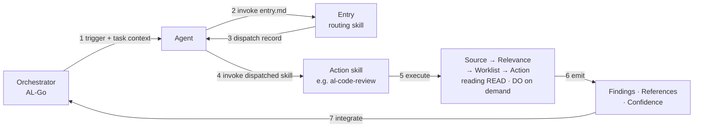

# How agents consume BCQuality

BCQuality is content — knowledge files and skills. It is consumed by agents that live elsewhere (AL-Go, a VS Code extension, a GitHub Agent invocation, etc.). This document explains the end-to-end flow, so that skill authors, orchestrator maintainers, and contributors share one mental model.

For the high-level framing and repo structure, start with the [README](README.md). This document is the operational view.

## The actors

- **Orchestrator** — the tool that triggers work (e.g. AL-Go on a pull request, or a VS Code extension on save). Lives *outside* BCQuality. Knows *when* to run something, not *what* to run.
- **Agent** — an LLM-driven process spawned by the orchestrator. The agent has no built-in knowledge of BC or of BCQuality's conventions. It knows how to read instructions and call tools.
- **BCQuality repo** — two kinds of content:
  - **Global skills** in `/skills/` — the `entry.md` entry-point skill plus the READ · DO · WRITE contracts that govern the rest of the repo.
  - **Layer content** in `/microsoft/`, `/community/`, and `/custom/` — knowledge files and action skills grouped by authority.

## The flow

### 1. Orchestrator triggers
The orchestrator has a URL setting that points at BCQuality (default: `github.com/microsoft/BCQuality`) and a task to perform. It hands the agent a **task context** — goal, inputs available (`pr-diff`, `file-path`, …), technologies, BC version, enabled layers — and says: *your source of truth lives at that URL; start by invoking `/skills/entry.md`*.

### 2. Agent invokes Entry
The agent reads `/skills/entry.md` and runs it against the task context. Entry applies its Source → Relevance → Worklist → Action steps over the action skills under `*/skills/**/*.md` and returns a **dispatch record**: the set of action skills to invoke, plus a list of candidates it skipped (with reasons). Routing is a skill, not orchestrator logic.

### 3. Agent consumes the dispatch record
The dispatch record names one or more action skills and the subset of inputs each should receive. If the outcome is `no-match` or `failed`, the agent returns the record to the orchestrator unchanged.

### 4. Agent invokes each dispatched action skill
Action skills live inside the layers — `/microsoft/skills/`, `/community/skills/`, `/custom/skills/` — so their authority is carried by their location. For a PR review, Entry typically dispatches `microsoft/skills/al-code-review.md`. The agent reads the file and executes it.

### 5. Action skill executes the four-step pattern

Each action skill is a markdown file that specifies what to do at each step. The template is always the same:

| Step | What happens |
| --- | --- |
| **Source** | Declare which knowledge folders and tags to search. |
| **Relevance** | Filter by frontmatter — `bc-version`, `technologies`, `countries`, `application-area`. |
| **Worklist** | Narrow from N candidates to the M that apply to this specific task. |
| **Action** | Apply the relevant knowledge and produce structured output. |

Example: a performance review skill sources from `/microsoft/knowledge/performance/` and `/community/knowledge/performance/`, filters to `bc-version: 26` and `technologies: [al]`, narrows the 25 candidate files to the 8 that apply to the 15 objects changed in the PR, and then evaluates each file against the diff.

At this point the agent reads READ and DO on demand — it needs READ to interpret each knowledge file's frontmatter and sections, and DO to shape its output. Those contracts are fetched when first needed, not as part of bootstrap.

### 6. Agent emits structured output
The output contract is defined in the DO meta-skill so that every action skill — today's and next year's — produces the same shape:

- **Outcome** — `completed`, `not-applicable`, `no-knowledge`, `partial`, or `failed`. An orchestrator can distinguish a clean run from a no-op from a failure without guessing.
- **Findings** — what the skill observed (severity, message, optional location).
- **References** — structured objects (`path` plus optional commit `sha`) pointing to the knowledge files that informed each finding.
- **Confidence** — per-finding evidence strength.
- **Suppressed** — knowledge files that were discarded by layer precedence or configuration, so reviewers can see what was overridden.

The orchestrator parses this **without skill-specific logic**. This is the point of the contract: orchestrators and action skills evolve independently.

### 7. Orchestrator integrates
The orchestrator turns findings into PR comments, build gates, or IDE diagnostics, and links the references back to the knowledge files so the PR author — human or agent — can read the guidance.

## Why this architecture

- **Entry is the only hardcoded thing.** Orchestrators ship with one convention — *"invoke `/skills/entry.md` first"* — and nothing else. New action skills and new knowledge files are picked up automatically because Entry discovers them at dispatch time.
- **Layers decide authority, not code.** The agent sees `/microsoft/` and `/community/` together; if two files conflict, the precedence rule defined in READ resolves it. A partner fork can disable `/community/` — that's a config choice, not a code change.
- **Knowledge and skills evolve independently.** A new knowledge file requires no skill changes — existing skills pick it up via frontmatter filters. A new skill requires no knowledge changes — it sources from what's already there.

## The mental model, in one sentence

The orchestrator knows **when** to run; Entry decides **which skill** to run; the action skills define **what** to do; the meta-skills teach the agent **how** to behave; the knowledge files are **what** the agent knows.
