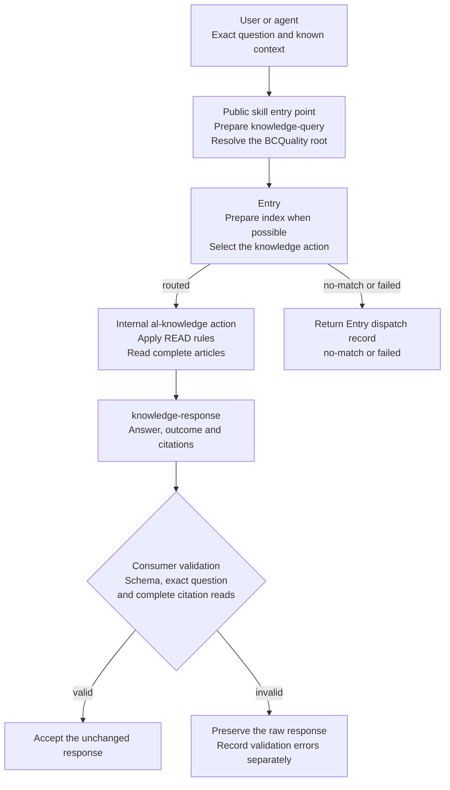
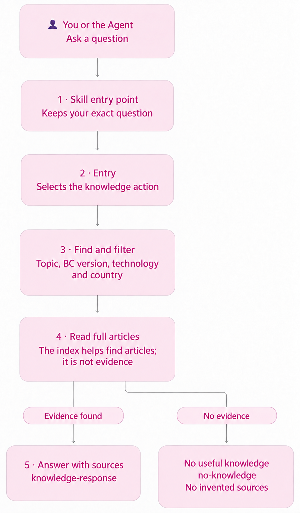

# Knowledge consultation for design and specification

[Documentation](README.md) | [Public skill entry point](../skills/al-knowledge/SKILL.md) | [Response validation](knowledge-response-validation.md)

`al-knowledge` helps AL coding agents design and specify Business Central
solutions using cited guidance from BCQuality. A user or agent can ask a focused
development question before source code exists. The skill follows BCQuality's
contracts and is independent of any particular consumer framework or agent role.
Available guidance is limited to the installed corpus.

## Ask a question

> Use al-knowledge to explain when SetLoadFields is useful in Business Central AL.
> Cite the BCQuality articles you read. Do not review my app. Return the
> knowledge-response JSON unchanged.

Supply the BC version, technologies, countries and application area when known.
Do not invent target details to make an article applicable. Unknown dimensions
remain explicit on conditional references under [READ](../skills/read.md).

## Request path

The public skill entry point is the file the host agent reads to start. It
preserves the exact question as `knowledge-query`, resolves the installed
BCQuality root, and follows [Entry](../skills/entry.md). Entry prepares the
knowledge index when possible and selects an action with compatible input types.
A question-only request cannot dispatch review actions.

The [internal knowledge action](../microsoft/skills/knowledge/al-knowledge.md)
finds relevant articles, checks applicability and layer precedence, reads their
full bodies, and returns cited guidance. Index entries support discovery but
are not evidence of complete reads. Bounded helpers require every continuation
page; when unavailable, native file reads must continue through EOF.

The host supplies the executing agent. It can follow these instructions inline
when no skill-invocation tool exists. Reading the skill entry point and Entry is
only preparation; the agent must execute the dispatched action and read articles.

[Editable explanatory diagram](assets/al-knowledge-diagram-en.mmd) and
[technical diagram source](assets/al-knowledge-technical-en.mmd).

## Response and acceptance

The action returns `knowledge-response` under [DO](../skills/do.md#knowledge-response-contract)
and its [schema](../schemas/knowledge-response.schema.json). `completed` requires
a useful answer and a verified citation. `no-knowledge` explains a gap with no
citations. `partial` explains unfinished work and cites only articles read.
`failed` explains a failure with no citations. Entry's `no-match` and `failed`
dispatch records remain separate and return unchanged.

The consumer validates the schema, exact bound question and complete citation
reads before acceptance. It preserves invalid output and records validation
errors separately. The optional [consumer validator](knowledge-response-validation.md)
checks question fidelity and full-read evidence against live files. Its evidence
comes from successful tool results in the same run, not the answering agent's
assertions. It does not independently prove that every claim follows a source.
READ still governs applicability and interpretation.

`al-code-review` remains the skill for review findings. Knowledge consultation
provides guidance, not a review verdict or a design approval gate.

## Prerequisites and optional tooling

The host agent needs access to the public skill entry point, Entry, READ, DO,
the internal action, response schema and enabled knowledge articles. It must
be able to read complete files and retain complete tool results. Authentication
to the agent provider follows the chosen host. No app, compiler or Business
Central tenant is required for a question-only consultation.

PowerShell 7.2 or later runs the existing bounded retrieval helpers. READ already
permits path discovery and native complete file reads when PowerShell, a helper,
or a prepared index is unavailable. Index write permission is needed only when
running Entry's generator.

Python with `jsonschema` is needed only for the proposed consumer validator.
Another consumer can enforce the same contract with its own implementation.
The read-evidence manifest is one proposed implementation, not a requirement
that all hosts adopt that format. Complete citation reads and response validation
remain required regardless of the tools selected.
